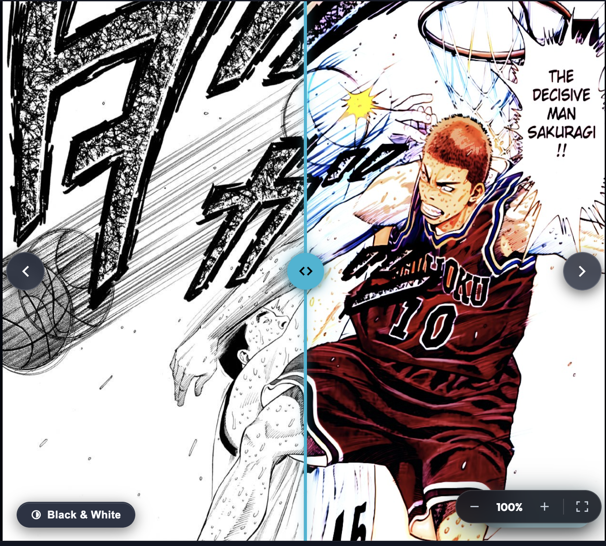
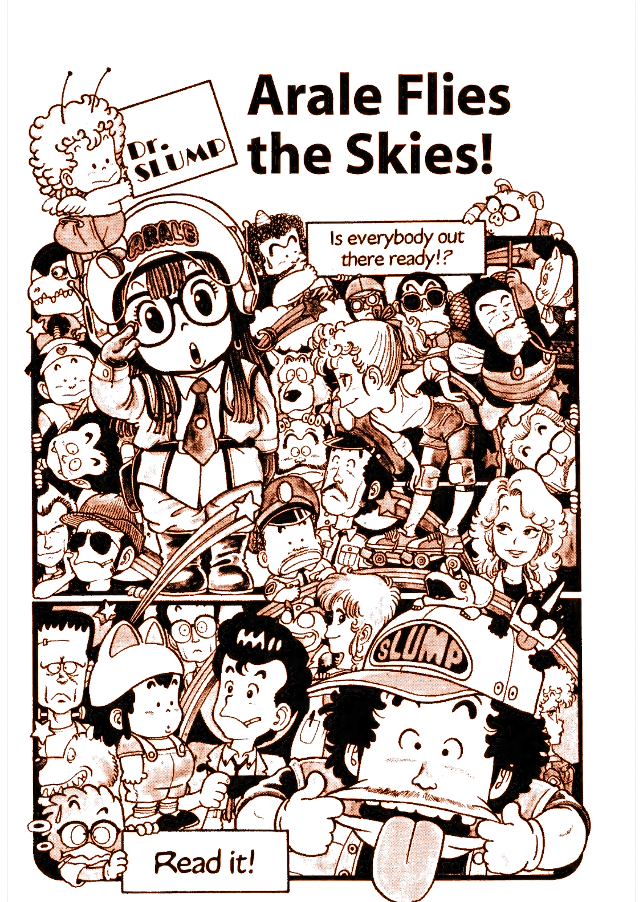
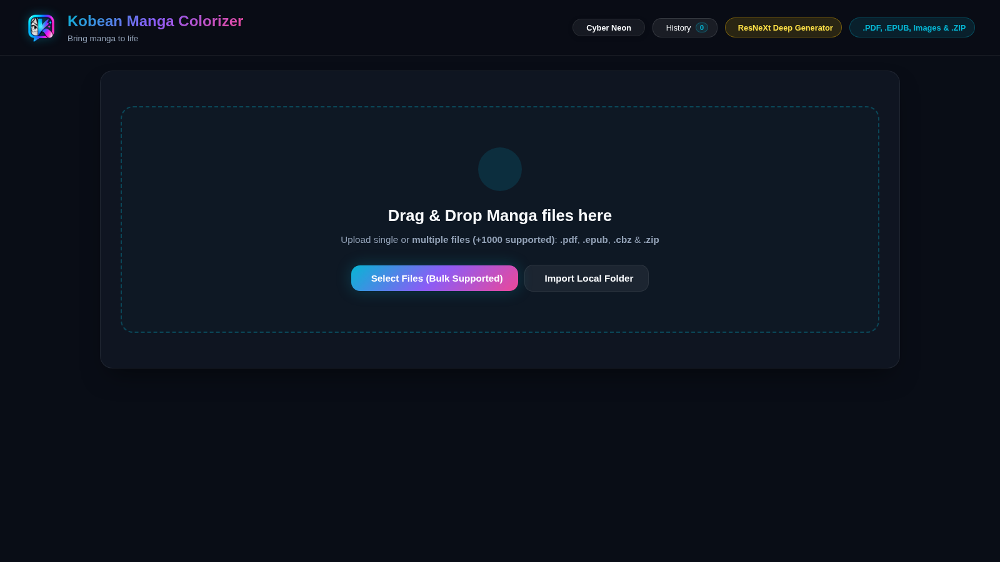
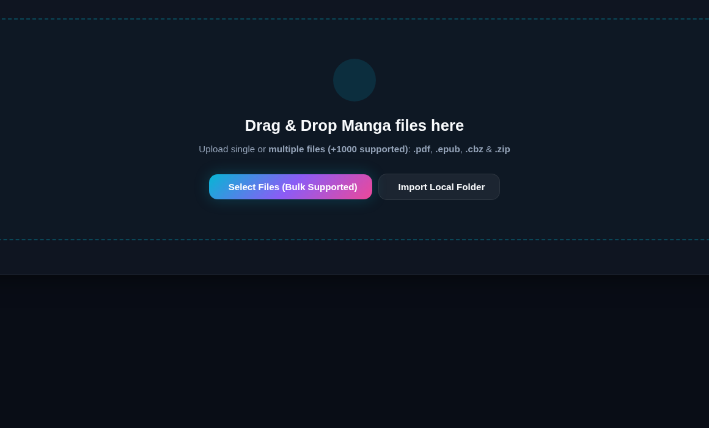
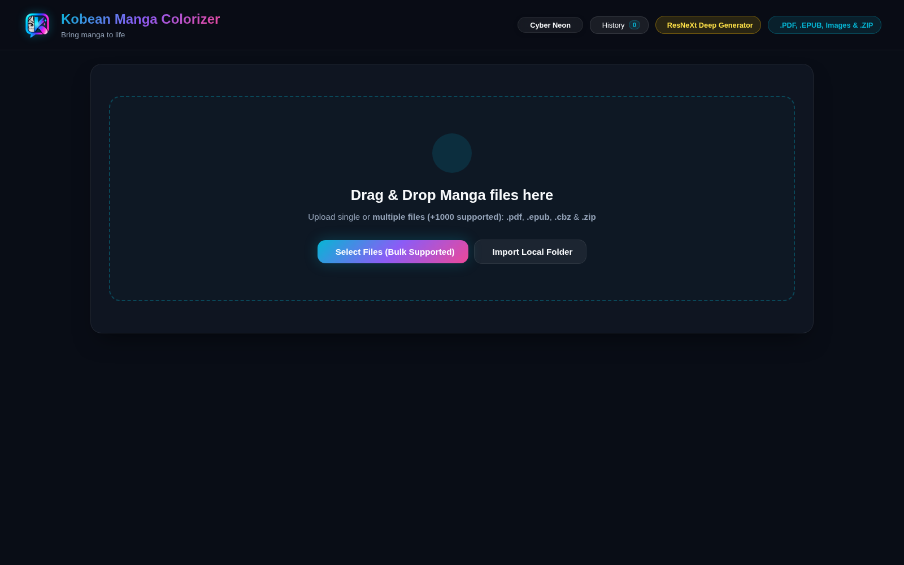
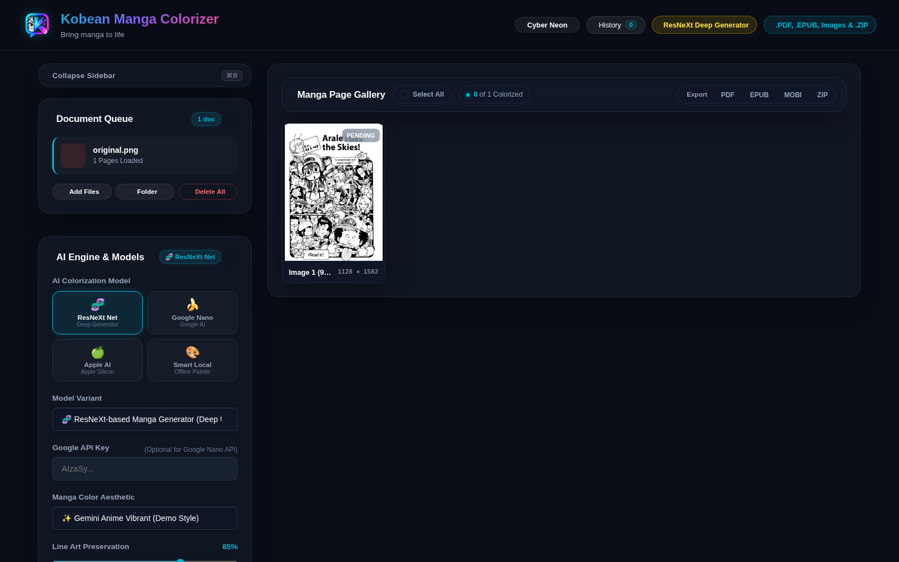
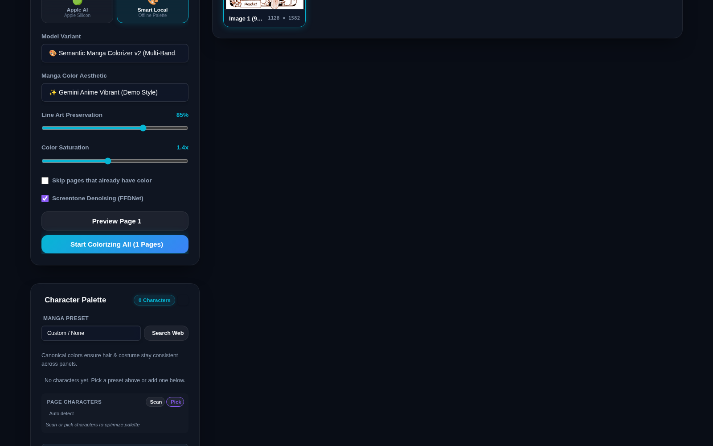
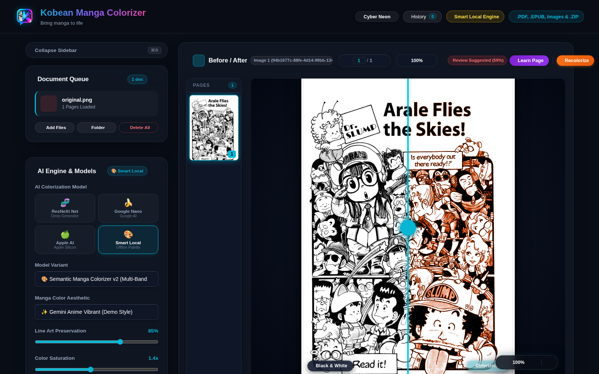

# 🎨 Kobean Manga Colorizer

<div align="center">

[](https://www.python.org/)
[](https://fastapi.tiangolo.com/)
[](https://pytorch.org/)
[](https://developer.apple.com/metal/pytorch/)
[](LICENSE)

**Next-Gen AI Manga & Comic Colorization Studio**  
*Transform black & white manga volumes into vibrant, publication-grade full-color editions with sub-second neural inference, strict aspect ratio preservation, and speech bubble protection.*

[Recent Highlights](#-recent-highlights) • [Features](#-key-features) • [Showcase](#-visual-showcase) • [Model Weights](#-model-weights-generatorzip) • [Quickstart](#-quickstart) • [Architecture](#-architecture) • [Storage Optimization](#-disk-space-optimization) • [API](#-api-reference)

</div>

---

## 🔥 Recent Highlights

- Refreshed demo color outputs by rerunning the app on `demo/original.png` and updating `demo/colorized.png` + `demo/process-output-colorized.png`.
- Added **page-level and selected-page recolorize controls** to rerun colorization without re-uploading files.
- Added **already-colored page preservation** (`skip_if_colored`) so pre-colored artwork can be retained during batch runs.
- Clarified workflow behavior: the **Start Colorize** action is enabled only after selecting at least one page in the gallery.

---

## ✨ Key Features

### 🧠 Multi-Engine AI Architecture
- **🧬 ResNeXt-50/101 Deep Generator**: Specialized semantic manga colorization network trained on thousands of manga panels (natural skin tones, vibrant anime hair, cloth textures, and expressive eyes).
- **🍌 Google Gemini 2.0 / Nano Banana**: Multimodal AI vision engine producing broadcast-quality anime colors, vivid skies, sound effects, and dynamic gradients.
- **⚡ Apple Silicon MPS & NVIDIA CUDA**: Native hardware acceleration delivering sub-second per-page colorization on Mac (M1/M2/M3/M4) and RTX GPUs.
- **💻 Smart Local Semantic Engine**: Ultra-fast offline heuristic colorization that runs anywhere with zero GPU requirements.

### ✒️ 100% Fidelity & Clean Line Art
- **Native Multiply Blending**: Preserves 100% of original ultra-high-resolution line art, fine hatching, and screentones without chromatic blurring.
- **Speech Bubble & Margin Shield**: Intelligent luminance masking guarantees page gutters, borders, and speech bubble interiors remain pure paper-white (`#FFFFFF`) with razor-sharp black dialogue text.
- **Zero Aspect Ratio Distortion**: Strict physical aspect ratio and DPI preservation across portrait, landscape, cover spreads, and wide banners.

### 📚 Multi-Document Batch Workflow
- **Universal Input Ingestion**: Drag & drop multiple **PDFs**, **EPUBs**, **ZIP archives**, or loose **PNG/JPG** images simultaneously.
- **Real-Time SSE Progress**: Live Server-Sent Events stream progress page by page directly into an interactive gallery view.
- **In-Browser Split-Screen Comparator**: Live draggable before/after comparison slider to inspect fine linework and color balance in real time.
- **Selective Recolorization**: Recolorize one page or only selected pages directly from the gallery controls.
- **Smart Colored-Page Detection**: Optionally detect already-colored pages and preserve them as original artwork in output.
- **Page & Session Management**: Delete unwanted filler/credit pages directly from the preview gallery before export.

### 💾 ~90% Ultra-Compact Storage
- **Optimized Extraction**: Automatically renders source pages to compact, high-quality JPEGs instead of uncompressed 24-bit PNGs (~85–90% disk reduction).
- **Stream-Deflated PDF Assembly**: Cross-reference cleaning (`garbage=4`, `deflate=True`) yields publication-grade PDFs under 80 MB per full tankōbon volume (down from ~800 MB).
- **Universal E-Reader Ready**: One-click export to **EPUB3** (Kindle, Apple Books, Kobo compliant), high-res **PDF**, or image **ZIP** archives using maximum compression (`compresslevel=9`).

---

## 🖼️ Visual Showcase

| Original Black & White Manga |                          AI-Colorized Edition                           |
| :---: |:-----------------------------------------------------------------------:|
|  |  |
| *Crisp original line art & screentones* |           *Vibrant anime palette, pure white speech bubbles*            |

### 📸 Real App Screenshots

| Studio Dashboard | Workspace & Controls |
| :---: | :---: |
|  |  |
| *Live web studio home interface* | *Document workflow area with tuning controls* |

### 🧪 End-to-End Process (Real Run)

| Step 1: Upload Screen | Step 2: Original Image Imported |
| :---: | :---: |
|  |  |
| *Choose input files from local disk* | *`demo/original.png` loaded into page gallery* |

| Step 3: Colorization Running | Step 4: Colorized Result in Comparator |
| :---: | :---: |
|  |  |
| *Batch colorization started for selected page* | *Before/after split view with generated color output* |

<p align="center">
  
  <br />
  <em>Generated colorized image exported from this run.</em>
</p>

---

## ⚡ Disk Space Optimization

Manga pages rendered as uncompressed PNGs can quickly consume 3–4 GB per volume. Kobean Manga Colorizer incorporates an intelligent compression pipeline that slashes disk consumption by **~90%** with zero perceptual loss:

| Stage | Before Optimization | After Optimization | Reduction | Fidelity Impact |
| :--- | :--- | :--- | :--- | :--- |
| **PDF Page Extraction** | ~15.3 MB / page (Raw PNG) | ~1.5 MB / page (Optimized JPG) | **~90.1%** | 100% native aspect ratio & resolution |
| **Colorized Image Cache** | ~15.3 MB / page (PNG) | ~1.7 MB / page (Optimized JPG) | **~88.9%** | Pure white bubbles, vivid colors |
| **Exported PDF Volume** | ~776 MB / volume | ~78 MB / volume | **~89.9%** | Cross-reference cleaned & deflated |
| **Exported EPUB Comic** | ~776 MB / volume | ~72 MB / volume | **~90.7%** | Kindle / Apple Books / Kobo compliant |

---

## 🏗️ Architecture

```
┌─────────────────┐       ┌────────────────────────┐       ┌────────────────────────┐
│  Upload Manga   │ ────> │  MangaFileProcessor    │ ────> │  ColorizerEngine       │
│  (PDF/EPUB/ZIP) │       │  - Native Aspect Ratio │       │  - ResNeXt Generator   │
└─────────────────┘       │  - High-Res Extraction │       │  - Gemini Multimodal   │
                          └────────────────────────┘       │  - Line Art Multiply   │
                                                           │  - White Paper Shield  │
                                                           └───────────┬────────────┘
                                                                       │
┌─────────────────────────┐       ┌────────────────────────┐           │
│  Universal Manga Export │ <──── │  SSE Progress Stream   │ <─────────┘
│  - EPUB3 Comic Book     │       │  - Live Gallery Events │
│  - Deflated PDF Volume  │       │  - Split-Screen Slider │
│  - High-Quality ZIP     │       └────────────────────────┘
└─────────────────────────┘
```

---

## 🚀 Quickstart

### 1. Prerequisites
- **Python 3.9+**
- **uv** (Recommended: `curl -LsSf https://astral.sh/uv/install.sh | sh` or `brew install uv`)
- *(Optional)* Apple Silicon Mac (M-series) or NVIDIA GPU for hardware-accelerated inference.

### 2. Instant Setup with `kobean`

```bash
# 1. Clone the repository
git clone https://github.com/kobet/kobean-manga-colorizer.git
cd kobean-manga-colorizer

# 2. One-command UV environment & alias setup
./kobean setup
```

This automatically synchronizes the `.venv` via `uv sync`, verifies model weights, and installs the global `kobean` CLI alias.

### 3. Model Weights (`generator.zip`)

The neural ResNeXt generator uses the pre-trained weights archive **`generator.zip`** (~129 MB). Because this file exceeds GitHub's 100 MB file limit, download it and place it in the `networks/` folder:

- 📥 **Google Drive (Direct)**: **[Download `generator.zip`](https://drive.google.com/file/d/1aIXUL1YHytRfkucujtfCPKpKyDwD_cpk/view?usp=sharing)**
- Place the downloaded file at: `networks/generator.zip`

```bash
# Verify the weights file is in place
ls -lh networks/generator.zip
```

> [!NOTE]
> If `generator.zip` is not found locally, the engine will attempt to automatically download it from HuggingFace on first launch. However, downloading it directly from the Google Drive link above is recommended for faster and more reliable setup.

### 4. Run the Studio

Launch the studio with the **`kobean` command**:

```bash
# Launch studio (auto-resolves ports & launches browser)
kobean run app

# Or launch with live auto-reload (development mode)
kobean run app --reload

# Or check system & acceleration status
kobean status
```

> [!TIP]
> - **All CLI Commands**:
>   - `kobean run app` — Launch web studio
>   - `kobean setup` — Install/sync UV dependencies
>   - `kobean test` — Run unit and regression tests
>   - `kobean lint` — Audit PEP 8 compliance via Ruff
>   - `kobean format` — Auto-format code to strict PEP 8
>   - `kobean status` — Hardware, port & disk stats
> - **Direct script fallback**: `./run.sh` or `python3 main.py` or `make run`

Open your browser at **[http://127.0.0.1:8000](http://127.0.0.1:8000)**.

---

## 📦 Model Weights (`generator.zip`)

| Model Asset | Size | Storage Path | Download Link |
| :--- | :--- | :--- | :--- |
| **`generator.zip`** | ~128.9 MB | `networks/generator.zip` | [Google Drive](https://drive.google.com/file/d/1aIXUL1YHytRfkucujtfCPKpKyDwD_cpk/view?usp=sharing) |
| **`extractor.pth`** | ~6.3 MB | `networks/extractor.pth` | Included in repository |
| **`net_rgb.pth`** | ~1.3 MB | `denoising/models/net_rgb.pth` | Included in repository |

> [!TIP]
> Make sure `generator.zip` is placed directly inside the `networks/` directory:
> ```
> kobean-manga-colorizer/
> └── networks/
>     ├── generator.zip   <-- Downloaded from Google Drive
>     ├── extractor.pth
>     └── models.py
> ```

## 💻 Web Studio Interface

1. **Upload Section**:
   - Drag & drop one or multiple manga files (`.pdf`, `.epub`, `.zip`, `.png`, `.jpg`).
   - Monitor real-time extraction progress in the document queue.
2. **Document Queue**:
   - Seamlessly switch between multiple volumes.
   - Delete individual pages or entire documents with the trash button.
3. **Controls & Tuning**:
   - Select AI Model: **ResNeXt Deep Generator**, **Google Nano / Gemini 2.0**, **Apple Foundation**, or **Smart Local**.
   - Pick Color Style: *Shonen Vivid*, *Gemini Anime*, *Pastel Shojo*, *Retro Comic*, or *Cyberpunk Neon*.
   - Fine-tune Saturation, Contrast, and Line Art Preservation sliders.
4. **Interactive Comparison**:
   - Click any page thumbnail to open the full-resolution split-screen comparator.
   - Slide back and forth to inspect line crispness and color vibrancy.
5. **Universal Export**:
   - Single document: Download as **PDF**, **EPUB**, or **ZIP**.
   - Batch export: Export all queue documents at once into a unified archive.

---

## 🔌 API Reference

| Endpoint | Method | Description |
| :--- | :---: | :--- |
| `/api/upload` | `POST` | Upload one or multiple manga files (PDF, EPUB, ZIP, images) |
| `/api/sessions` | `GET` | Retrieve list of all uploaded manga sessions |
| `/api/session/{id}` | `GET` | Get session metadata, page list, and processing statuses |
| `/api/session/{id}` | `DELETE` | Delete document session and remove all files from disk |
| `/api/session/{id}/page/{idx}` | `DELETE` | Delete single page and automatically re-index sequence |
| `/api/colorize/preview` | `POST` | Generate instant single-page preview with specified style/settings |
| `/api/colorize/start` | `POST` | Start full volume colorization for a document |
| `/api/colorize/batch/start` | `POST` | Start sequential batch colorization across all uploaded documents |
| `/api/colorize/stream/{id}` | `GET` | Server-Sent Events (SSE) live progress stream |
| `/api/export/{id}?format={fmt}` | `POST` | Build colorized export (`pdf`, `epub`, or `zip`) |
| `/api/export/batch` | `POST` | Build batch archive across multiple sessions (`auto`, `epub`, `pdf`, `zip`) |

---

## 🧪 Testing

The test suite includes end-to-end regression tests, aspect ratio preservation tests, deletion tests, and compression benchmarks:

```bash
# Run all automated tests via test discovery
./venv/bin/python3 -m unittest discover tests

# Or run specific test modules directly
./venv/bin/python3 tests/test_compression_optimization.py
./venv/bin/python3 tests/test_aspect_ratio.py
./venv/bin/python3 tests/test_export_formats.py
./venv/bin/python3 tests/test_delete_features.py
./venv/bin/python3 tests/test_multi_files.py
```

---

## 🗺️ Roadmap

- [x] Multi-file batch upload and concurrent queue management
- [x] ResNeXt-50/101 Generator neural colorization pipeline
- [x] Exemplar anime fusion matching official Japanese color editions
- [x] Compliant EPUB3 & PDF deflated exports
- [x] 90% disk space compression optimization
- [ ] Automated Speech Bubble OCR & Text Translation pipeline
- [ ] Vertical Webtoon continuous scroll reading mode
- [x] Custom character palette memory (consistent hair/costume colors across panels)

---

## 📄 License

This project is licensed under the **MIT License** — see the [LICENSE](LICENSE) file for details.

---

<div align="center">
Made with ❤️ for manga readers and comic artists worldwide. josephthien - kobenguyent
</div>
